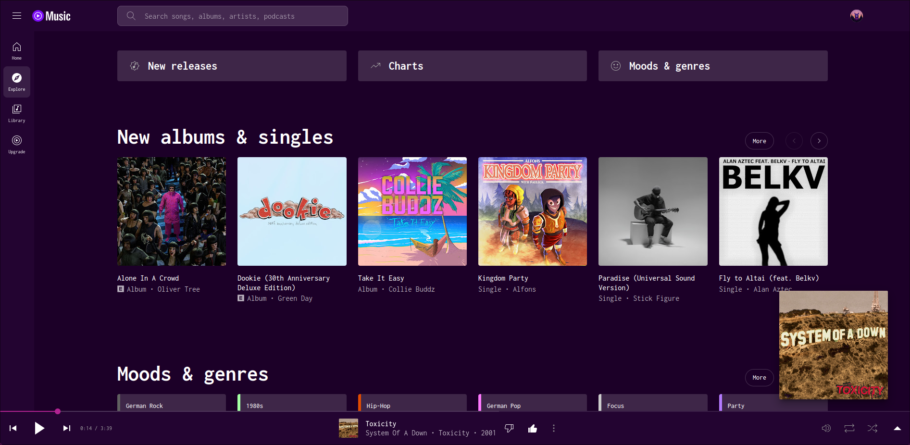

# YTMusic Amethyst
A purple theme for YouTube Music

## Screenshots

## Installation

First, you need a userstyle manager. Stylus is recommended:

> - [Stylus for Chrome](https://chrome.google.com/webstore/detail/stylus/clngdbkpkpeebahjckkjfobafhncgmne) 
> - [Stylus for Firefox](https://addons.mozilla.org/firefox/addon/styl-us/) 

Once you have a manager, install the theme by clicking [here](https://github.com/Xenorio/YouTube-Music-Amethyst/raw/main/ytm-amethyst.user.css).
